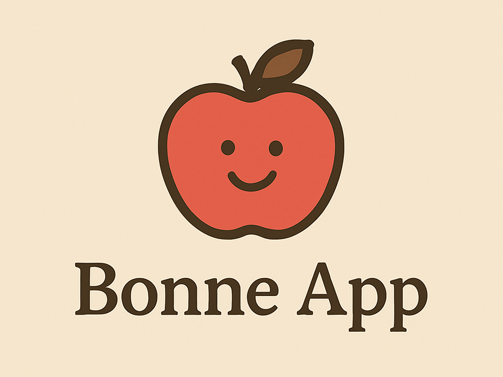

# Bonne App（プロダクト名）

## 製品概要
### 背景(製品開発のきっかけ、課題等）
一人暮らしの大学生は、自宅で一人でYouTubeなどの動画を見ながら食事をとることが多くあります。このような「ながら食べ」によって咀嚼回数の減少や早食いが起こり、健康リスクの増大や、食事から得られる精神的な満足感の低下が懸念されます。「ながら食べ」をする原因を私たちのグループで考えた所、以下のような課題があると思いました。

* 静かな場所でひとりで食事するのが寂しい。
* 日々、同じような食事で食べることに興味がない。

### 製品説明（具体的な製品の説明）

### 特長
#### 1.　リアルタイムで1分間あたりの咀嚼回数を表示!!
カメラの顔認識で口の動きから咀嚼回数をで計測します。
#### 2. デイリーミッションを設定!!
毎日変わるミッションで日々の食事の楽しさを気づかせます。

(例)
* 「料理の香りを楽しもう!」
* 「今日は料理しよう!」

#### 3. 食事中にBGMが流れます!
スタートボタンを押すと、心地よいBGMが流れます。

### 解決出来ること
* 咀嚼回数から早食いをしているかどうか意識できます。
* 食事中のBGMで寂しさを紛らわすことができます。
* デイリーミッションを通じて、毎日の食事に刺激を与えます。

### 今後の展望
顔認識では、1分あたりの咀嚼回数だけでなく、一口あたりの咀嚼回数の計測をできるようにしたり、食べる時の姿勢をカメラで認識できるようにしたいです。また、履歴情報からグラフを作成しデータを可視化するアルゴリズムを実装するつもりです。さらに、統計情報から個人にカスタマイズされたデイリーミッションを提示するプログラムを加え、ユーサビリティを高めます。

### 注力したこと（こだわり等）
* 咀嚼回数の計測には、Googleの顔認識ライブラリであるMediapipeを用いました。顔上のランドマーク同士の距離を計算し、口周りの距離の変化から咀嚼回数の計測を実現しました。顔の左右の向き・カメラとの前後の距離の変化にも適応して計測が可能です。
* デイリーミッションの項目は、毎日ランダムに変わります。データベースに記録することで、再度ログインしても、その日中、ミッションが変わらないように工夫しました。
* アプリ名「Bonne App」には由来があります! フランス語で「召し上がれ」を意味する"Bon appetit"と「良いアプリケーション」を意味する"Bonne application"をかけました。

## 開発技術
### 活用した技術
#### API・データ
* なし

#### フレームワーク・ライブラリ・モジュール
* Flask
* SQLAlchemy
* bootstrap
* WTForms
* Mediapipe

#### デバイス
* PC

### 独自技術
#### ハッカソンで開発した独自機能・技術
* ハックデイ1週間前からMediapipeの顔認識で咀嚼回数を検出するプログラムを書いた。
* ハックデイではデータベースを用いて毎日ランダムに変わるデイリーミッションのプログラムを書いた。
